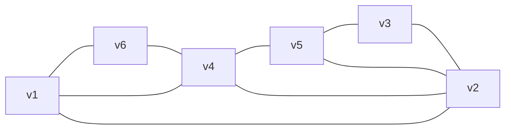
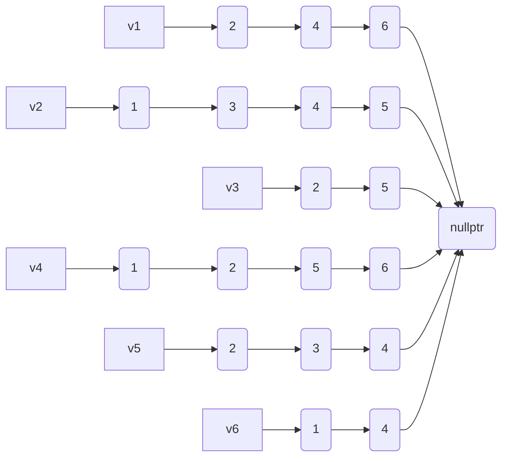
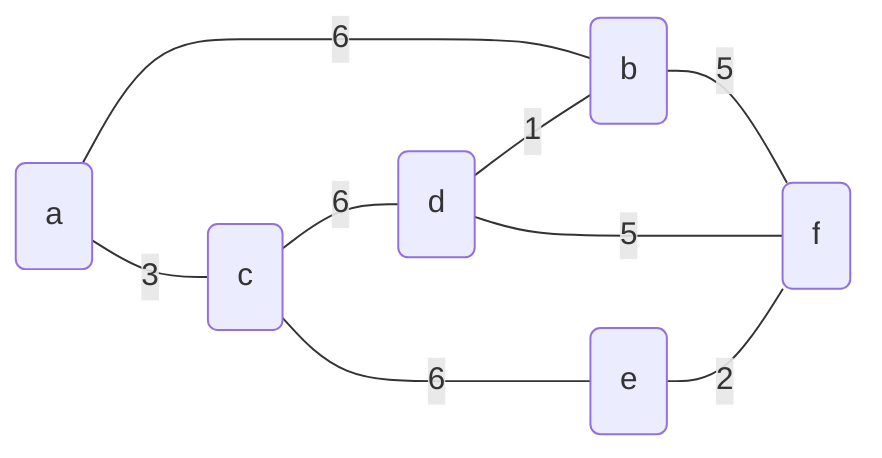
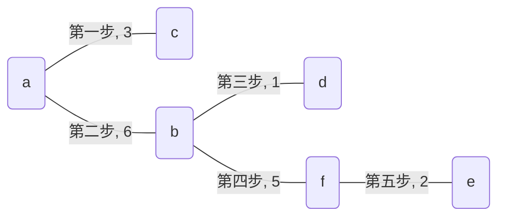
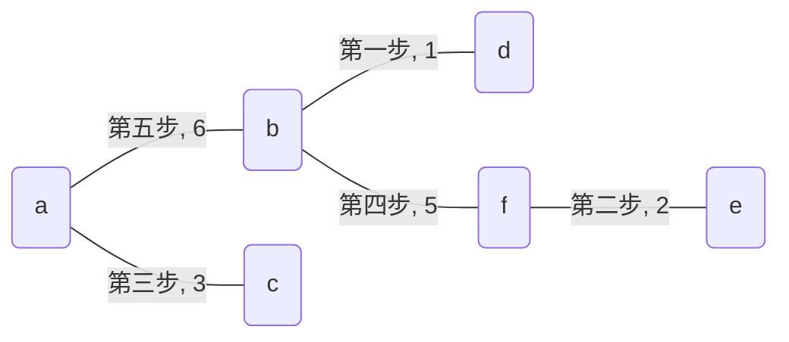
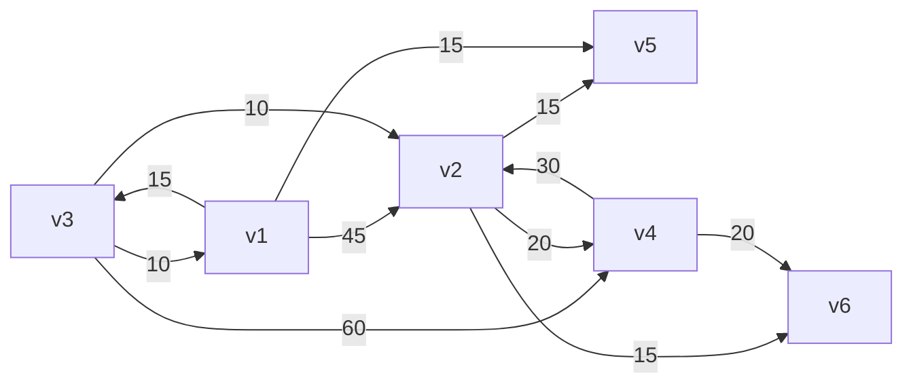

# 数据结构第六次书面作业

<center>
<b>
    19336035 陈梓乐
</b>
</center>

---

[TOC]
---

## n个顶点的无向图，采用邻接表储存，回答下列问题
### 图中边数
```cpp
size_t getSizeOfEdge(Graph &G) const {
    return accumulate(
        G.v.begin(), 
        G.v.end(), 
        0, 
        [](size_t init, auto & v) {
            return init + v.e.size();
        }
    ) / 2;
}
```
### 任意两个顶点是否有边相连
```cpp
bool islinked(node &i, node &j) const noexcept {
    for (auto k: i.e)
        if (k == &j)
            return true;
    return false;
}
```
### 任意一个节点的度
```cpp
size_t numOfEdge(node &i) const noexcept {
    return i.e.size();
}
```

## 有n个节点的无向图，用邻接矩阵储存，回答下列问题
### 图中的边数
```cpp
size_t getSizeOfEdge(vector<vector<size_t>> &p) {
    return accumulate (
        p.begin(), 
        p.end(),
        0, 
        [](size_t init, auto &t) {
            return init + accumulate(
                t.begin(),
                t.end(),
                0, 
                [](size_t init, auto &e) {
                    return init + bool(e);
                }
            );
        }
    );
}
```
### 任意两个顶点是否有边相连
```cpp
bool islinked(
    vector<vector<size_t>> &p,
    size_t i,
    size_t j
) const noexcept {
    return p[i][j];
}
```
### 任意一个顶点的度
```cpp
size_t numOfEdge(
    vector<vector<size_t>> &p,
    size_t i
) const noexcept {
    return accumulate(
        p[i].begin(),
        p[i].end(),
        0, 
        [](size_t init, auto &t) {
            return init + bool(t);
        }
    );
}
```

## 证明：生成树中最长路径的起点与终点度数都为1
**证明**：假定已经确定了生成树最长路径为数列$\{a_k, k\in N^+\}$，假定$a_1$度数并非为1，则存在额外一点与$a_1$相连。可以证明这一点一定不在数列中，因为生成树不可能有回路。而只要找到这一点$a_0$，那么我们会有更长的路径$\{a_k, k\in N\}$。

## 已知图1，求邻接矩阵与邻接表示意图
<center>



图1
</center>

邻接矩阵表示如下：

```math
\begin{bmatrix} 
0 & 1 & 0 & 1 & 0 & 1\\
1 & 0 & 1 & 1 & 1 & 0\\
0 & 1 & 0 & 0 & 1 & 0\\
1 & 1 & 0 & 0 & 1 & 1\\
0 & 1 & 1 & 1 & 0 & 0\\
1 & 0 & 0 & 1 & 0 & 0\\
\end{bmatrix}
```

邻接表表示如下：
<center>


</center>
深度优先遍历：$v_1, v_2, v_3, v_5, v_4, v_6$.

广度优先遍历：$v_1, v_2, v_4, v_6, v_3, v_5$.

## 图2是无向带权图，分别按Prim算法和Kruskal算法求最小生成树
<center>



图2
</center>

Prim 算法生成最小生成树图示：
<center>


</center>

Kruskal 算法生成最小生成树图示：
<center>


</center>
## 利用Dijkstra算法求图3中$v_1$到其他点的最短路径

<center>


图3
</center>

**解答**：如下表

<center>

|次序|源点|终点|最短路径|最短路径长度|
|--|--|--|--|--|
|1|$v_1$|$v_3$|$v_1, v_3$|15|
|2|^|$v_5$|$v_1, v_5$|15|
|3|^|$v_2$|$v_1, v_3, v_2$|25|
|4|^|$v_6$|$v_1, v_3, v_2, v_6$|40|
|5|^|$v_4$|$v_1, v_3, v_2, v_4$|45|
</center>

## 证明：适当排列次序可以使得有向无环图邻接矩阵中主对角线以下元素全部为0
