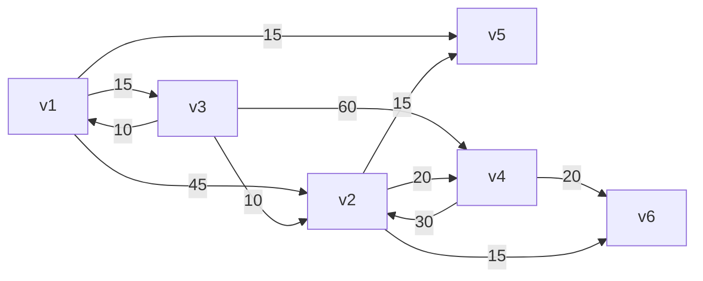

# 第七次上机作业题目

## 图的遍历
基于**有向图**的**邻接矩阵**表示法，要求如下：
1. 从文件读入顶点与边的数据，建立图
2. 实现DFS与BFS
3. 查找顶点x的信息

图如下：

## 使用Prim和Kruskal算法，设计粤港澳大湾区的超高速骨干网
我们使用爬虫程序 `02/getData.py` 获取到了两两城市间的大致路程，保存在 `02/data.mdb` 中。现在根据这些信息可以建立最小生成树。