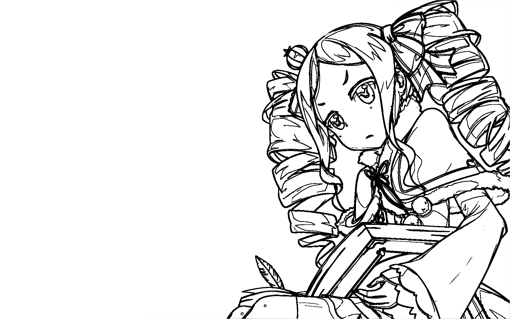

# 实验报告
**19336035 陈梓乐**

---
- 实验报告
    - 实验目的
    - 数据爬取
    - 图像处理
        - 提取边界点算法
        - 图片边界哈希
        - 构图相似度
        - 聚类算法
    - 实验结果

---
## 实验目的
本实验是为了探讨动漫作品的二次创作中是否有较为受欢迎的构图。

## 数据爬取
我们从壁纸网站 [https://wall.alphacoders.com](https://wall.alphacoders.com) 中爬取了最受欢迎的3097张壁纸。为了防止某一作品的二次创作图片受该作品影响而构图相似，我们的图片来源于不同的45个作品，并保证每一作品拥有不少于10张的图片。

## 图像处理
为了衡量图像的构图相似度，我们必须清楚怎么样来表示一个图像的构图。所谓“构图”，其实指的是边界点所在的坐标。换言之，若已知图像的所有边界点的坐标，即可认为这既是构图。为此，我们对图像进行提取边界点的处理。

### 提取边界点算法 
为了提取图像的边界点，我们需要知道如何衡量图像的边界点。通常而言，渐变的颜色并非边界，而聚变的颜色是边界。因此对于每一个像素点，定义它为”边界“， 当且仅当它与周围的一个领域色彩有很大的区别。定义一个**差别尺度**，定义与周围领域差别大于**差别尺度**的点为**边界点**。下图展示了一副彩色图片经过提取边界点变换之后，得到的图像。图中可以看到边界点的提取效果是显著的。

||
|---|
|原图|
|
|处理后|

### 图片边界哈希
我们发现，图片经过提取边界点算法处理后，所含有的信息是有限的。例如，上图的构图可以用一句话概括就是“在右边”。因此，既然信息量极少，我们便可以用一个哈希值来表示图片的构图，这样的哈希值应该满足以下定义：
1. 哈希值应该可以描述图片的构图。
2. 给定两个哈希值，可以获取图像构图的相似度。
3. 调色之后的图片与调色前的图片拥有一样的哈希值。

为此我们给出以下计算哈希值的定义：
1. 将图片重置为N*N的大小。
2. 提取重置后图片的边界点，**差别尺度**定为使得边界点占整张图片一半的尺度。
3. 将边界点定为1，将非边界点定为0，获得一个0-1的有序数列。
4. 将该二进制数定义为图片的哈希。

用这种方法，我们定义了一个哈希函数，符合我们想要的性质。这个哈希函数是将图片映射为数值，即：$$ hash(Picture; N)\rightarrow N$$
显然，若哈希值的二进制中，0-1分布越均匀，所包含的信息越少，该图片越倾向于平滑改变的图像。若1产生堆积，则说明堆积的那一块地方是构图的区域。并且调色后，若该调色没有损失构图信息，它的哈希值不会改变。Python计算图片边界哈希的代码如下，在这里，$N=10$：
```python
def getPicHash(filename):
    try:
        img = numpy.asarray(Image.open(filename).resize((10, 10)).convert("L"))
        var = []
        ans = 0
        neighbor = [(-1, -1), (-1, 0), (-1, 1), (0, -1), (0, 1), (1, -1), (1, 0), (1, 1)]
        for i in range(1, 9):
            for j in range(1, 9):
                _var = 0
                for k in neighbor:
                    x = i + k[0]
                    y = j + k[1]
                    _var += (int(img[i][j]) - int(img[x][y]))**2
                _var /= 8
                var.append(_var)
        median = numpy.median(var)
        for i in var:
            ans *= 2
            if (i > median):
                ans += 1
        return int(ans)
    except:
        return 0
```

### 构图相似度
接下来，让我们来定义图像构图的相似度。设两张图片的边界哈希分别为 `hash1` 和 `hash2`。相似度可定义为：若两个哈希值相同位置上的二进制位也相同，则该位置是构图相似的。构图相似的位置占所有位置的比例称之为构图相似度。显然相似度在0~1之间。等价地，图片的相似度可定义为 $hash_1\space xor\space hash_2$ 中1的数量。Python代码如下：
```python
def getSimilar(hash1, hash2):
    ans = 0
    similar = hash1^hash2
    while (similar != 0):
        similar &= (similar - 1)
        ans += 1
    return 1 - ans/64
```
于是我们定义了一个函数衡量图片的相似度，这个函数将两张图片映射为[0, 1]之间的实数，即：
$$ Similar(Picture_1, Picture_2) = getSimilar(hash(Picture_1), hash(Picture_2)) $$

### 聚类算法
用并查集算法，找出相似程度超过95%的图片，并将其定义为**一类**。在这里，我们找到了最常出现的三类。这三类的图片一共是79张，仅占2.5%。

## 实验结果
我们对上述的三类分别输出到三张图片中，其中，若一个像素点是更多图片的边界点，则该点越黑，于是该点的灰度为 $Num*100/Len(class)$%，其中Num指的是该类中该点是边界点的图片个数。我们对这三类的结果展示如下：

<table>
  <tr>
    <th>类别1</th>
    <th></td>
    <th></td>
  </tr>
  <tr>
    <th>类别2</td>
    <th></td>
    <th></td>
  </tr>
  <tr>
    <th>类别3</td>
    <th></td>
    <th></td>
  </tr>
</table>

在这个实验结果中，我们直观地看到这样的聚类是合理的，效果是显著的，因此我们确实找到了几类构图方式，是在动漫作品的二次创作中经常用的，但这些作品仅仅占所有最受欢迎作品中的2.5%，而即使把聚类算法的**类别**标准放宽到相似程度为90%，有相似构图方式的作品也只是占所有作品的11%，因此我们发现，即使在二次创作中有一些常见的构图方法，但更多的优秀作品的构图是与众不同的、别出心裁的。因此我们确信优秀的二次创作作品是独一无二的。