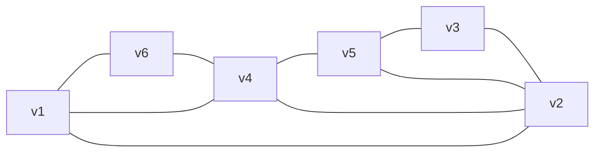
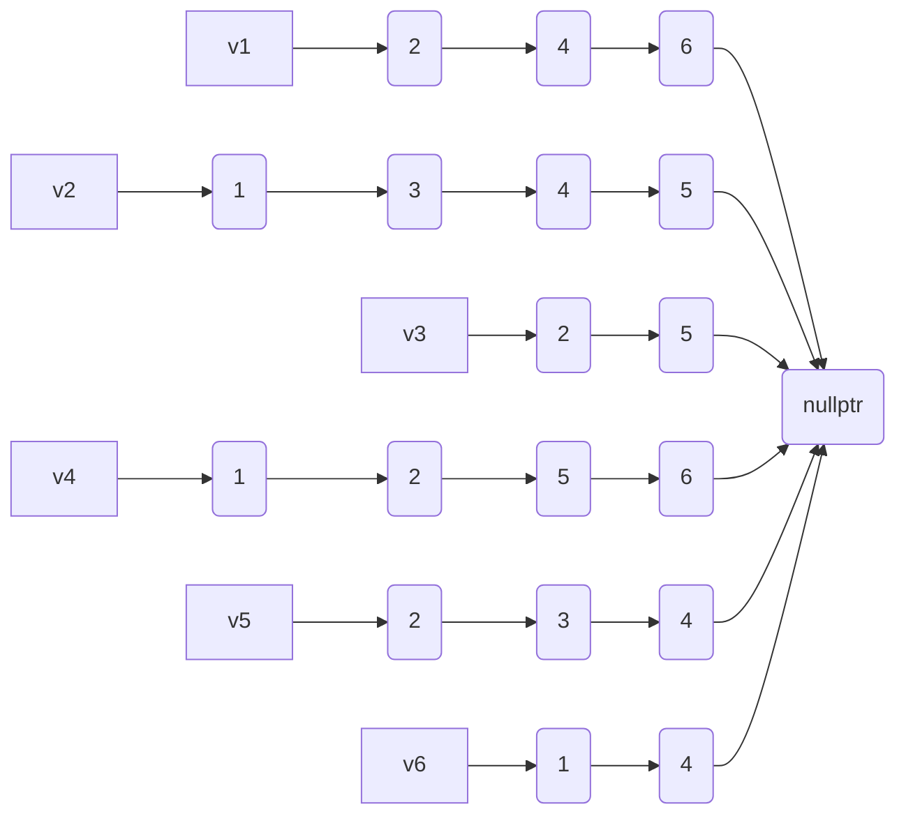
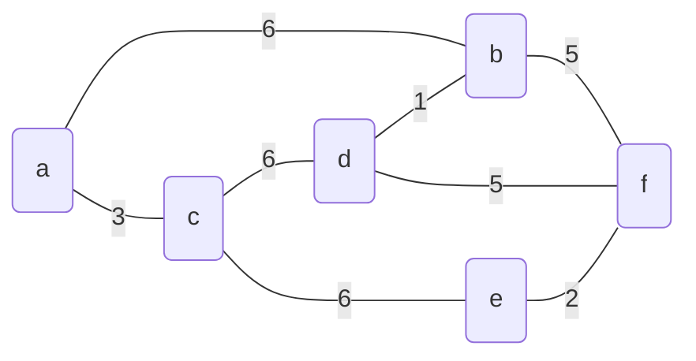
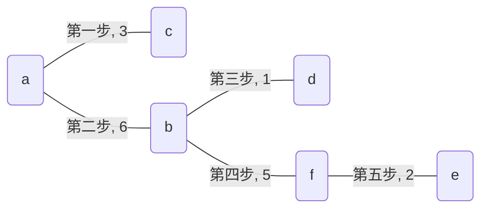
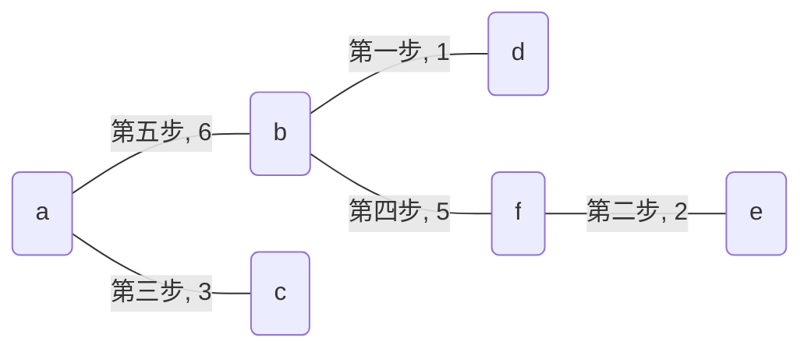
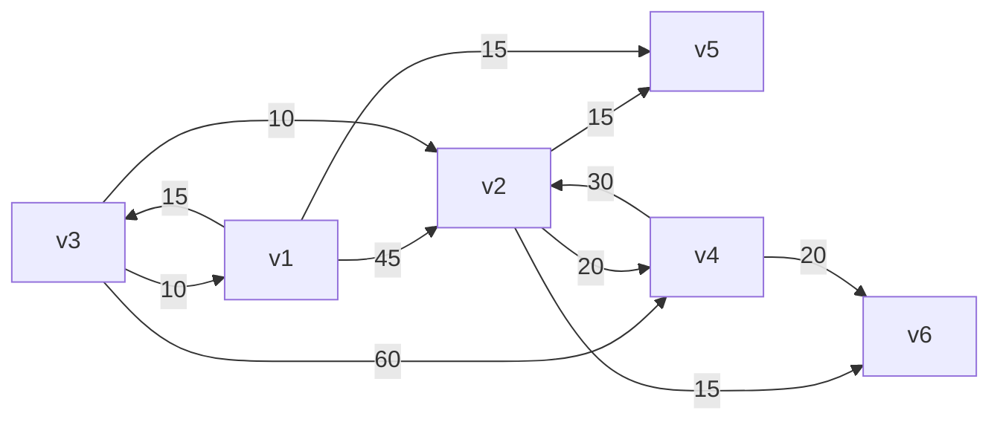
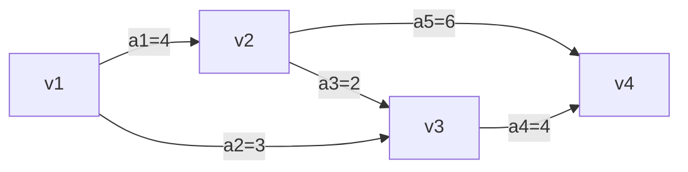
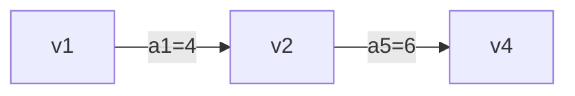

---
toc:
    ordered: true
html:
    embed_local_images: true
    embed_svg: true
    offline: true
    toc: true

print_background: false
export_on_save:
    html: true
---

# 数据结构第六次书面作业

<center>
<b>
    19336035 陈梓乐
</b>
</center>

---

[TOC]
---

## n个顶点的无向图，采用邻接表储存，回答下列问题
### 图中边数
```cpp
size_t getSizeOfEdge(Graph &G) const {
    return accumulate(
        G.v.begin(), 
        G.v.end(), 
        0, 
        [](size_t init, auto & v) {
            return init + v.e.size();
        }
    ) / 2;
}
```
### 任意两个顶点是否有边相连
```cpp
bool islinked(node &i, node &j) const noexcept {
    for (auto k: i.e)
        if (k == &j)
            return true;
    return false;
}
```
### 任意一个节点的度
```cpp
size_t numOfEdge(node &i) const noexcept {
    return i.e.size();
}
```

## 有n个节点的无向图，用邻接矩阵储存，回答下列问题
### 图中的边数
```cpp
size_t getSizeOfEdge(vector<vector<size_t>> &p) {
    return accumulate (
        p.begin(), 
        p.end(),
        0, 
        [](size_t init, auto &t) {
            return init + accumulate(
                t.begin(),
                t.end(),
                0, 
                [](size_t init, auto &e) {
                    return init + bool(e);
                }
            );
        }
    );
}
```
### 任意两个顶点是否有边相连
```cpp
bool islinked(
    vector<vector<size_t>> &p,
    size_t i,
    size_t j
) const noexcept {
    return p[i][j];
}
```
### 任意一个顶点的度
```cpp
size_t numOfEdge(
    vector<vector<size_t>> &p,
    size_t i
) const noexcept {
    return accumulate(
        p[i].begin(),
        p[i].end(),
        0, 
        [](size_t init, auto &t) {
            return init + bool(t);
        }
    );
}
```

## 证明：生成树中最长路径的起点与终点度数都为1
**证明**：假定已经确定了生成树最长路径为数列$\{a_k, k\in N^+\}$，假定$a_1$度数并非为1，则存在额外一点与$a_1$相连。可以证明这一点一定不在数列中，因为生成树不可能有回路。而只要找到这一点$a_0$，那么我们会有更长的路径$\{a_k, k\in N\}$。

## 已知图1，求邻接矩阵与邻接表示意图
<center>



图1
</center>

邻接矩阵表示如下：

```math
\begin{bmatrix} 
0 & 1 & 0 & 1 & 0 & 1\\
1 & 0 & 1 & 1 & 1 & 0\\
0 & 1 & 0 & 0 & 1 & 0\\
1 & 1 & 0 & 0 & 1 & 1\\
0 & 1 & 1 & 1 & 0 & 0\\
1 & 0 & 0 & 1 & 0 & 0\\
\end{bmatrix}
```

邻接表表示如下：
<center>


</center>
深度优先遍历：$v_1, v_2, v_3, v_5, v_4, v_6$.

广度优先遍历：$v_1, v_2, v_4, v_6, v_3, v_5$.

## 图2是无向带权图，分别按Prim算法和Kruskal算法求最小生成树
<center>



图2
</center>

Prim 算法生成最小生成树图示：
<center>


</center>

Kruskal 算法生成最小生成树图示：
<center>


</center>
## 利用Dijkstra算法求图3中$v_1$到其他点的最短路径

<center>


图3
</center>

**解答**：如下表

<center>

|次序|源点|终点|最短路径|最短路径长度|
|--|--|--|--|--|
|1|$v_1$|$v_3$|$v_1, v_3$|15|
|2|^|$v_5$|$v_1, v_5$|15|
|3|^|$v_2$|$v_1, v_3, v_2$|25|
|4|^|$v_6$|$v_1, v_3, v_2, v_6$|40|
|5|^|$v_4$|$v_1, v_3, v_2, v_4$|45|
</center>

## 证明：适当排列次序可以使得有向无环图邻接矩阵中主对角线以下元素全部为0
**证明**：有向无环图是树，将树按照层序遍历排列，主对角线以下的元素就全都为0.

## 关于图4所示的有向网图，求各活动最早开始时间及最晚开始时间，写出关键活动和关键路径。
<center>


图4
</center>

|各事件最早开始时间以及最晚开始时间|||||
|:--:|:--:|:--:|:--:|:--:|
|开始时间|>|>|>|事件|
|^|$v_1$|$v_2$|$v_3$|$v_4$|
|最早开始时间|0|4|6|10|
|最晚开始时间|0|4|6|10|

|各活动最早开始时间和最晚开始时间||||||
|:--:|:--:|:--:|:--:|:--:|:--:|
|开始时间|>|>|>|>|事件|
|^|$a_1$|$a_2$|$a_3$|$a_4$|$a_5$|
|最早开始时间|0|0|4|6|4|
|最晚开始时间|0|3|4|6|4|

关键活动是$a_1, a_3, a_4, a_5$，构成关键路径有两条如图所示

<center>


路径1



路径2

</center>
## 设计算法，将无向图的邻接矩阵转化为邻接表
```cpp
void Array2Lst(
    vector<vector<bool>> & p,
    vector<vertex> &v
) const {
    for (auto i = 0; i < p.size(); ++i) 
        for (auto j = 0; j < p[i].size(); ++j)
            if (p[i][j])
                v[i].e.push_back(v.begin() + j);
}
```

## 设计算法，将无向图的邻接表转化为邻接矩阵
```cpp
void Array2Lst(
    vector<vector<bool>> & p,
    vector<vertex> &v
) const {
    for (auto i = 0; i < v.size(); ++v) 
        for (auto &j : i.e)
            p[i][j - v.begin()] = 1;
}
```

## 设计算法，计算出度为0的顶点个数
```cpp
size_t sum0(vector<vector<bool>> & p) {
    size_t ans = 0;
    for (auto &i: p)
        ans += !accumulate(i.begin(), i.end(), 0);
    return ans;
}
```

## 深度优先遍历邻接表储存的图
```cpp
void DFS(vertex &v) {
    if (v.visited)
        return;
    v.visited = 1;
    for (auto &i: v.e)
        DFS(*i);
}
```

## 从有向图的邻接表获得逆邻接表
```cpp
void reverse(
    vector<vertex> &v, 
    vector<vertex> &vr
) const {
    for (auto i = v.begin(); i != v.end(); ++i)
        for (auto &j : i -> e)
            vr[j - v.begin()].e.push_back(
                vr.begin() + int(i - v.begin())
            );
}
```

## 基于深度优先算法与广度优先算法，判断i, j之间是否有通路
深度优先遍历在之前的题目中已经给过代码，这里直接调用
```cpp
bool islinked(vertex &i, vertex &j) {
    DFS(i);
    return j.visited;
}
```

下面给出广度优先搜索算法：
```cpp
bool islinked(vertex &i, vertex &j) {
    queue<vertex> q;
    q.push(i);
    while (q.size()) {
        for (auto &k: q.top().e)
            if (k -> visited == 0) {
                q.push(*k);
                k -> visited = 1;
            }
        q.pop();
    }
    return j.visited;
}
```
