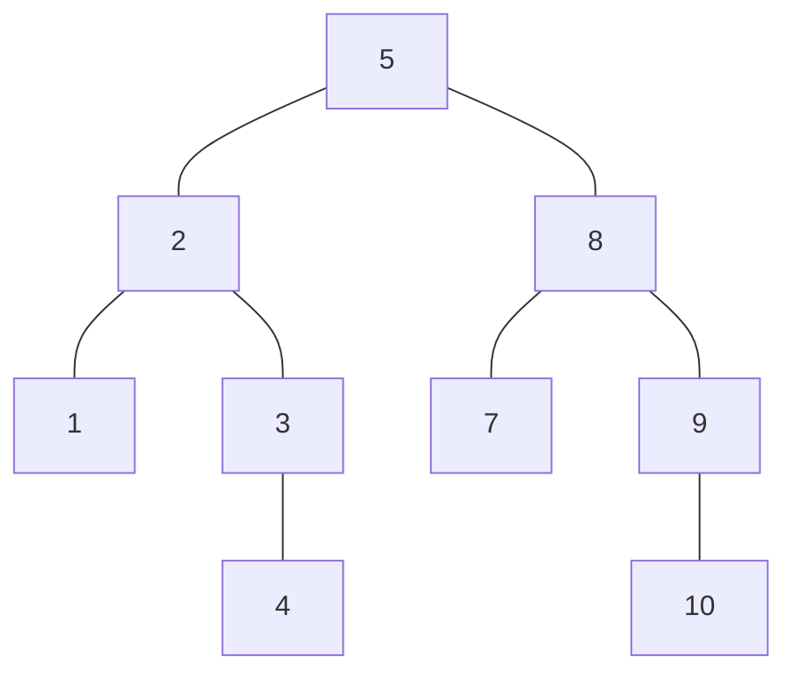
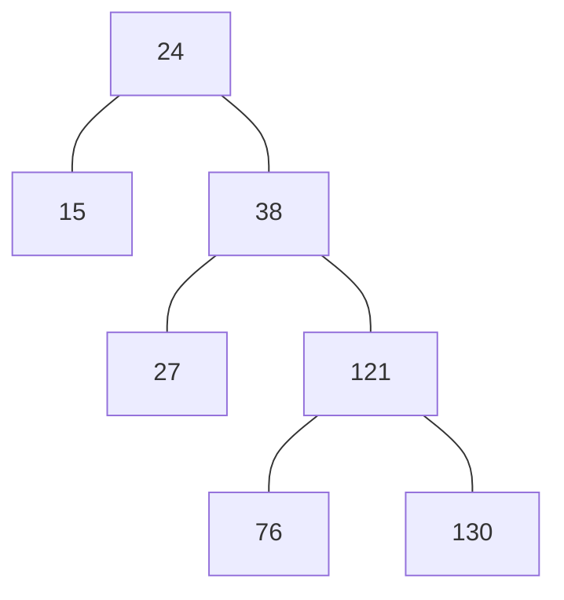
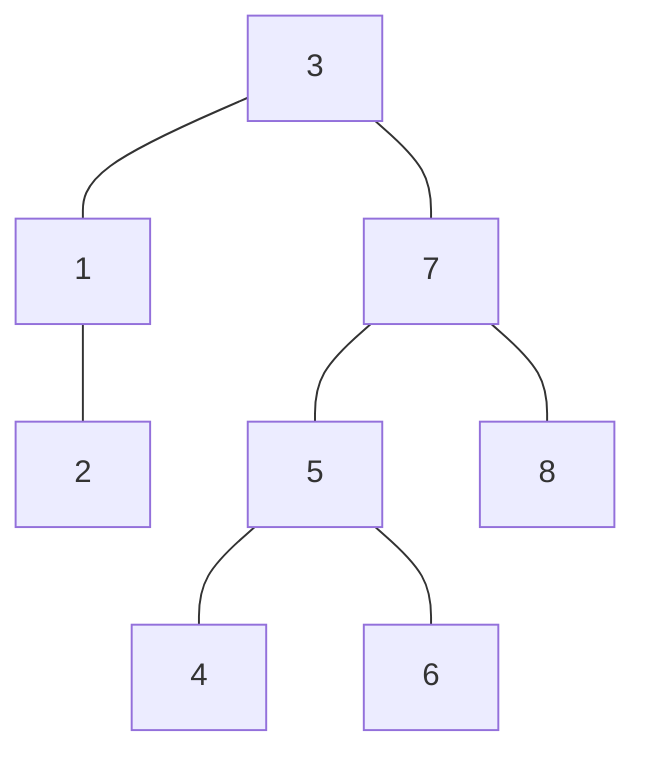
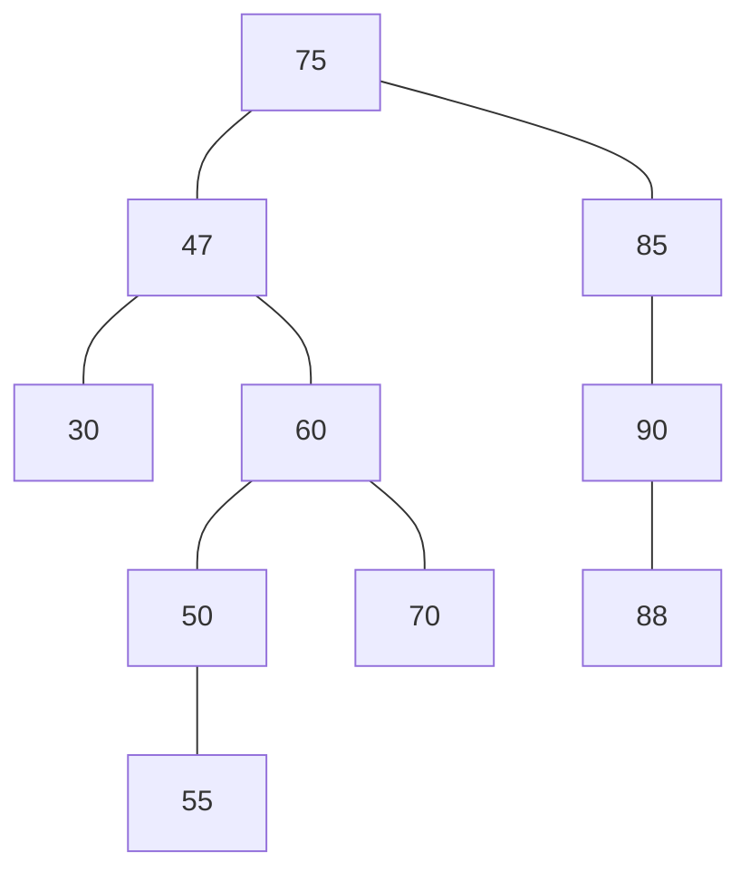
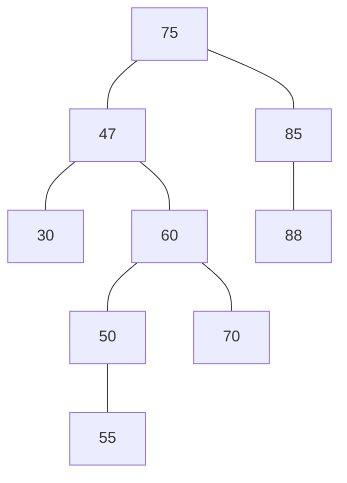
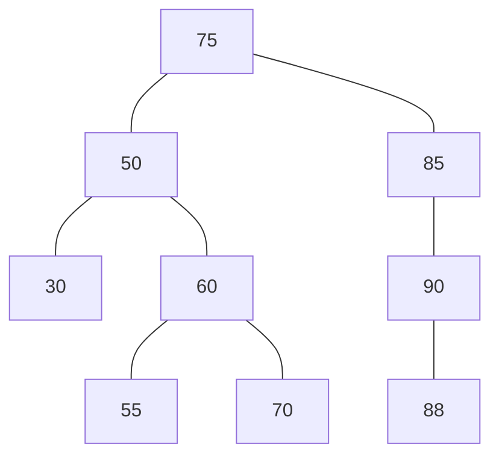

# 数据结构与算法第七次书面作业

---
<center>
<b> 19336035 陈梓乐 </b> <br>
<b> 部分代码可以在 <a href = "gitee.com/Czile/homework">gitee.com/Czile/homework</a> 上找到 </b><br>
<u>*本作业中关于二叉树的图使用mermaid实现，当根节点只有一个子树时可能显示异常*</u>
</center>

---
[TOC]

---
## 简答题
### 1. 画出线性表 (a, b, c, d, e, f, g) 进行折半搜索e与g的示意图。

|a|b|c|d|e|f|g|Find|
|-|-|-|-|-|-|-|-|
|i|-|-|mid|-|-|**j**|**g**|
|-|-|-|-|**i** && **mid**|j|-|**e**|

### 2. 画出长度为10的折半查找判定树，求等概率时查找成功和不成功的平均查找长度
<center>


</center>

查找的平均长度为 
$$ \frac{1}{10} \times 1 + \frac{2}{10}\times2 + \frac{4}{10}\times3 + \frac{2}{10}\times4 = 2.5 $$

### 3. 将数列 (24, 15, 38, 27, 121, 76, 130) 依次插入二叉排序树，请画出最后结果以及等概率情况下查找的平均长度
<center>


</center>
查找平均长度为：
$$ \frac{1}{7}\times1+\frac{2}{7}\times2+\frac{2}{7}\times3+\frac{2}{7}\times4=\frac{19}{7}$$

### 4. 请将二叉排序树的值 (1-8) 填入空格中
<center>


</center>

### 5. 二叉排序树如图5-1所示，请分别画出删除元素90和47之后的二叉排序树

<table>
<tr>
<th> 5-1 </th>
<th> 5-2 </th>
<th> 5-3 </th>
</tr>
<tr>
<th>


</th>
<th>


</th>
<th>


</th>
<tr>
</table>

### 6. 已知散列函数H(k) = k mod 12, 关键字序列为 (25, 37, 52, 43, 84, 99, 120, 15, 26, 11, 70, 82), 用拉链法处理冲突，构造散列表，求平均查找次数。

|0|1|2|3|4|5|6|7|8|9|10|11|
|:-:|:-:|:-:|:-:|:-:|:-:|:-:|:-:|:-:|:-:|:-:|:-:|
|84|25|26|99|52|**NA**|43|**NA**|||70|11|
|120|37|**NA**|15|**NA**||||||82|**NA**|
|**NA**|

平均查找长度为
$$ \frac{8}{12}\times1+\frac{4}{12}\times2 = \frac{4}{3} $$

### 7. 设散列表长度为15，散列函数 H(k) = k mod 13， 关键字集合为 (53, 17, 12, 61, 89, 70, 87, 25, 64, 46), 使用二次探测法处理冲突，构造散列表并计算平均查找次数。

||0|1|2|3|4|5|6|7|8|9|10|11|12|13|14|
|:-:|:-:|:-:|:-:|:-:|:-:|:-:|:-:|:-:|:-:|:-:|:-:|:-:|:-:|:-:|:-:|
元素|-|53|-|-|17|70|-|46|64|61|87|89|12|25|
冲突数|0|1|0||1||0|1|5|1|2|1||2|1|

因此平均查找次数为：
$$ \frac{7}{10}\times1+\frac{2}{10}\times2+\frac{1}{10}\times5=1.6 $$

### 8. 给定关键字序列为 (26, 25, 20, 34, 28, 24, 45, 64, 42), 装填因子为 0.6， 用线性探测法处理冲突，构造散列函数，画出散列表。

由装填因子，知表长为15，于是可以设散列函数为 $H(k)=k\space mod\space 15$, 构造的散列函数如表所示：
||0|1|2|3|4|5|6|7|8|9|10|11|12|13|14|
|:-:|:-:|:-:|:-:|:-:|:-:|:-:|:-:|:-:|:-:|:-:|:-:|:-:|:-:|:-:|:-:|
元素|26|-|28|42|-||45|20|34|-||24|25|64|-|

## 算法设计题

### 1. 设计顺序表查找算法，把哨兵设在下标高端。

```cpp
// NOTE: There may be a memory leak.
template<class InputIterator, class T>
InputIterator find (InputIterator first, InputIterator last, const T& val) {
    *last = val;
    for (; *first != val; ++first);
    return first;
}
```

### 2. 求给定节点在二叉排序树的层数
```cpp
template <class T>
int depth(Binary_Search_Tree<T> * root, const T &val) {
    if (root -> val == val) 
        return 1;
    return ((root -> val < val) ? (root -> right, val) : (root -> left, val)) + 1;
}
```

### 3. 编写算法求二叉排序树上任意两个不同节点的最近公共祖先
```cpp
template <class T>
Binary_Search_Tree<T> * Ancestor(
    const Binary_Search_Tree <T> * a, 
    const Binary_Search_Tree <T> * b
) {
    for (auto i = a; i != nullptr; i = i -> parents)
        for (auto j = b; j != nullptr; j = j -> parents)
            if (i == j)
                return i;
    return nullptr;
}
```

### 4. 判定二叉树是否为二叉排序树
```cpp
template <class T>
bool isSortTree(Binary_Tree<T> * root) {
    if (root == nullptr)
        return true;
    if (root -> left && root -> left -> val > root -> val ||
        root -> right && root -> right -> val < root -> val)
        return false;
    return isSortTree(root -> left) && isSortTree(root -> right);
}
```

### 5. 使用线性探测法解决冲突的散列表中，设计算法实现删除操作
```cpp
template <class T>
void HashErase(HashList<T> &p, const T & val) {
    auto location = p.Hash(val);
    for (
        ; 
        *location != val && *location != p.default(); 
        location = ((location + 1 == p.end()) ? p.begin() : location) + 1
    );
    if (*location == p.default())
        throw "Invalid value to delete";
    for (
        ;
        *location != p.default();
        location = ((location + 1 == p.end()) ? p.begin() : location) + 1
    )
        *location = *(((location + 1 == p.end()) ? p.begin() : location )+ 1);
}
```
## 思考题
### 关于MD5
MD5是一种摘要算法，本质上是一个散列函数，它能用于描述数据的特征。
我们首先假设我们有一个 $b$ 位消息作为输入，并且我们希望找到它的消息摘要。这里 $b$ 是一个任意的非负整数；b 可以是零，它不必是 8 的倍数，它可以是任意大的。我们想象一下写下的消息位如下：
$$ m_0 m_1 ... m_{b-1}$$
我们执行以下五个步骤来计算消息的消息摘要。

#### 第一步： 扩展位数
在本操作中，数列将会被扩展为一个“标准数列”，所谓标准数列即要求为最终位数对512求余数的结果为448，于是扩展位数为1-512位。注意，不能是0位，即便是最初的数列本身就是“标准数列”，也要扩展512位。假定扩展的位数是C位，扩展操作为：
1. 令$a_b=1$.
2. 令$a_c = 0, 0 < c - b < C$

#### 第二步： 扩展长度
用一个64位的数列表示b，即表示扩展位数前的位数，补在扩展位数之后，这样，数列的长度变成512的倍数。

#### 第三步： 初始化MD5寄存器
MD5运算要用到一个128位的MD5缓存器，用来保存中间变量和最终结果。该缓存器又可看成是4个32位的寄存器A、B、C、D，初始化为
```cpp
word A: 01 23 45 67
word B: 89 ab cd ef
word C: fe dc ba 98
word D: 76 54 32 10
```

#### 第四步： 计算
我们首先定义四个辅助函数，每个函数将三个 32 位字作为输入，并产生一个 32 位字作为输出。

$$F(X,Y,Z) = XY or not(X) Z\\
G(X,Y,Z) = XZ or Y not(Z)\\
H(X,Y,Z) = X xor Y xor Z\\
I(X,Y,Z) = Y xor (X or not(Z))\\$$
关于函数的性质，详细的描述如下：
>In each bit position F acts as a conditional: if X then Y else Z. The function F could have been defined using + instead of v since XY and not(X)Z will never have 1's in the same bit position.) It is interesting to note that if the bits of X, Y, and Z are independent and unbiased, the each bit of F(X,Y,Z) will be independent and unbiased.

> The functions G, H, and I are similar to the function F, in that they act in "bitwise parallel" to produce their output from the bits of X, Y, and Z, in such a manner that if the corresponding bits of X, Y, and Z are independent and unbiased, then each bit of G(X,Y,Z), H(X,Y,Z), and I(X,Y,Z) will be independent and unbiased. Note that the function H is the bit-wise "xor" or "parity" function of its inputs.

> This step uses a 64-element table T[1 ... 64] constructed from the sine function. Let T[i] denote the i-th element of the table, which is equal to the integer part of 4294967296 times abs(sin(i)), where i is in radians. The elements of the table are given in the appendix.

这些函数都是独立而无偏的， 接着利用这些函数执行以下程序：

```cpp
/* Process each 16-word block. */
      For i = 0 to N/16-1 do
/* Copy block i into X. */
        For j = 0 to 15 do
        Set X[j] to M[i*16+j].
        end /* of loop on j */
/* Save A as AA, B as BB, C as CC, and D as DD. */
        AA = A
        BB = B
        CC = C
        DD = D
 /* Round 1. */
        /* Let [abcd k s i] denote the operation
        a = b + ((a + F(b,c,d) + X[k] + T[i]) <<< s). */
        /* Do the following 16 operations. */
        [ABCD 0 7 1] [DABC 1 12 2] [CDAB 2 17 3] [BCDA 3 22 4]
        [ABCD 4 7 5] [DABC 5 12 6] [CDAB 6 17 7] [BCDA 7 22 8]
        [ABCD 8 7 9] [DABC 9 12 10] [CDAB 10 17 11] [BCDA 11 22 12]
        [ABCD 12 7 13] [DABC 13 12 14] [CDAB 14 17 15] [BCDA 15 22 16]
 /* Round 2. */
        /* Let [abcd k s i] denote the operation
        a = b + ((a + G(b,c,d) + X[k] + T[i]) <<< s). */
        /* Do the following 16 operations. */
        [ABCD 1 5 17] [DABC 6 9 18] [CDAB 11 14 19] [BCDA 0 20 20]
        [ABCD 5 5 21] [DABC 10 9 22] [CDAB 15 14 23] [BCDA 4 20 24]
        [ABCD 9 5 25] [DABC 14 9 26] [CDAB 3 14 27] [BCDA 8 20 28]
        [ABCD 13 5 29] [DABC 2 9 30] [CDAB 7 14 31] [BCDA 12 20 32]
 /* Round 3. */
        /* Let [abcd k s t] denote the operation
        a = b + ((a + H(b,c,d) + X[k] + T[i]) <<< s). */
        /* Do the following 16 operations. */
        [ABCD 5 4 33] [DABC 8 11 34] [CDAB 11 16 35] [BCDA 14 23 36]
        [ABCD 1 4 37] [DABC 4 11 38] [CDAB 7 16 39] [BCDA 10 23 40]
        [ABCD 13 4 41] [DABC 0 11 42] [CDAB 3 16 43] [BCDA 6 23 44]
        [ABCD 9 4 45] [DABC 12 11 46] [CDAB 15 16 47] [BCDA 2 23 48]
 /* Round 4. */
        /* Let [abcd k s t] denote the operation
        a = b + ((a + I(b,c,d) + X[k] + T[i]) <<< s). */
        /* Do the following 16 operations. */
        [ABCD 0 6 49] [DABC 7 10 50] [CDAB 14 15 51] [BCDA 5 21 52]
        [ABCD 12 6 53] [DABC 3 10 54] [CDAB 10 15 55] [BCDA 1 21 56]
        [ABCD 8 6 57] [DABC 15 10 58] [CDAB 6 15 59] [BCDA 13 21 60]
        [ABCD 4 6 61] [DABC 11 10 62] [CDAB 2 15 63] [BCDA 9 21 64]
 /* Then perform the following additions. (That is increment each
        of the four registers by the value it had before this block
        was started.) */
        A = A + AA
        B = B + BB
        C = C + CC
        D = D + DD
 end /* of loop on i */
```

#### 第五步： 输出
作为输出产生的消息摘要是 A、B、C、D。 也就是说，我们从 A 的低位字节开始，以 D 的高位字节结束。

这样就完成了对 MD5 的描述。
#### 应用[<sup>11</sup>](#Ref)
##### 用于密码管理
当我们需要保存某些密码信息以用于身份确认时，如果直接将密码信息以明码方式保存在数据库中，不使用任何保密措施，系统管理员就很容易能得到原来的密码信息，这些信息一旦泄露， 密码也很容易被破译。为了增加安全性，有必要对数据库中需要保密的信息进行加密，这样，即使有人得到了整个数据库，如果没有解密算法，也不能得到原来的密码信息。MD5算法可以很好地解决这个问题，因为它可以将任意长度的输入串经过计算得到固定长度的输出，而且只有在明文相同的情况下，才能等到相同的密文，并且这个算法是不可逆的，即便得到了加密以后的密文，也不可能通过解密算法反算出明文。这样就可以把用户的密码以MD5值（或类似的其它算法）的方式保存起来，用户注册的时候，系统是把用户输入的密码计算成 MD5 值，然后再去和系统中保存的 MD5 值进行比较，如果密文相同，就可以认定密码是正确的，否则密码错误。通过这样的步骤，系统在并不知道用户密码明码的情况下就可以确定用户登录系统的合法性。这样不但可以避免用户的密码被具有系统管理员权限的用户知道，而且还在一定程度上增加了密码被破解的难度 [8]  。
##### 电子签名
MD5 算法还可以作为一种电子签名的方法来使用，使用 MD5算法就可以为任何文件（不管其大小、格式、数量）产生一个独一无二的“数字指纹”，借助这个“数字指纹”，通过检查文件前后 MD5 值是否发生了改变，就可以知道源文件是否被改动。我们在下载软件的时候经常会发现，软件的下载页面上除了会提供软件的下载地址以外，还会给出一串长长的字符串。这串字符串其实就是该软件的MD5 值，它的作用就在于下载该软件后，对下载得到的文件用专门的软件（如 Windows MD5 check 等）做一次 MD5 校验，以确保我们获得的文件与该站点提供的文件为同一文件。利用 MD5 算法来进行文件校验的方案被大量应用到软件下载站、论坛数据库、系统文件安全等方面 [8]  。
##### 垃圾邮件筛选
在电子邮件使用越来越普遍的情况下，可以利用 MD5 算法在邮件接收服务器上进行垃圾邮件的筛选，以减少此类邮件的干扰，具体思路如下：
建立一个邮件 MD5 值资料库，分别储存邮件的 MD5 值、允许出现的次数（假定为 3）和出现次数（初值为零）。
对每一封收到的邮件，将它的正文部分进行MD5 计算，得到 MD5 值，将这个值在资料库中进行搜索。
如未发现相同的 MD5 值，说明此邮件是第一次收到，将此 MD5 值存入资料库，并将出现次数置为1，转到第五步。
如发现相同的 MD5 值，说明收到过同样内容的邮件，将出现次数加 1，并与允许出现次数相比较，如小于允许出现次数，就转到第五步。否则中止接收该邮件。结束。
接收该邮件 [8]  。
#### 总结
MD5 消息摘要算法实现简单，并提供任意长度消息的“指纹”或消息摘要。据推测，提出具有相同消息摘要的两条消息的难度约为 2^64 次操作，而提出具有给定消息摘要的任何消息的难度约为 2^128 次操作。MD5 算法已被仔细审查过弱点。然而，它是一种相对较新的算法，进一步的安全分析当然是合理的，就像任何此类新提案的情况一样。

#### Ref
1.  黄声国, 吴蕃. 浅谈RSA公司事件“后门”[J]. 中国金融电脑, 2014(7):62-64.
2.  么丽颖. MD5算法的分析和改进[J]. 哈尔滨师范大学自然科学学报, 2011, 27(5):34-37.
3.  王可. MD5算法研究[J]. 中文信息, 2002(2):78-81.
4.  Kaliski B. The MD2 Message-Digest Algorithm[M]. 1992.
5.  Rivest R. The MD4 Message-Digest Algorithm[M]// Advances in Cryptology-CRYPT0’ 90. 1990.
6.  刘俊辉. MD5 消息摘要算法实现及改进[J]. 福建电脑, 2007 (4): 92-93.
7.  舒畅. MD5 算法原理及其碰撞攻击[J]. 软件导刊, 2007, 6(6): 103-104.
8.  桑海, 李建宝. 加密算法MD5的研究与应用[J]. 金融科技时代, 2006, 14(4):74-77.
9.  http://www.fastsum.com/rfc1321.php
10. https://eprint.iacr.org/2009/223.pdf
11. https://baike.baidu.com/item/MD5/212708?fr=aladdin
12. Rivest, R., "The MD4 Message Digest Algorithm", RFC 1320, MIT and RSA Data Security, Inc., April 1992.
13. Rivest, R., "The MD4 message digest algorithm", in A.J. Menezes and S.A. Vanstone, editors, Advances in Cryptology - CRYPTO '90 Proceedings, pages 303-311, Springer-Verlag, 1991.
14. CCITT Recommendation X.509 (1988), "The Directory - Authentication Framework."